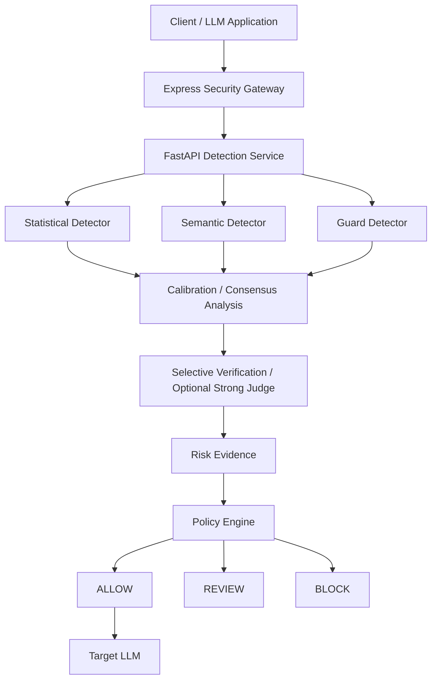

# Adversarial Attack Detection for Large Language Models (LLMs)

This project develops a practical, model-agnostic security middleware and gateway for LLM applications. The goal is to provide layered defenses for adversarial prompt handling, policy enforcement, and operational visibility without forcing a single monolithic detector design.

## Project Status

This is an active university capstone and research project. Current parallel workstreams include:

- dataset acquisition and forensic review
- research architecture and threat modeling
- project documentation and governance
- detector and gateway design planning

The system is not yet complete, and final benchmark or dataset roles remain under review.

## Problem

LLM applications are exposed to a wide range of adversarial prompt patterns, including:

- direct prompt injection
- indirect prompt injection
- jailbreaks and persona-driven attacks
- adaptive evasion and prompt obfuscation
- policy bypass attempts and unsafe instruction following

A robust detection layer must account for these risks while remaining lightweight enough for real production use.

## Project Goal

The project aims to support a lightweight, pluggable security middleware for LLM applications with:

- incoming prompt screening
- optional outgoing response screening
- multiple heterogeneous detector channels
- conditional stronger verification for uncertain cases
- policy enforcement and routing decisions
- logging and security dashboard evidence

The intent is to make detection architecture extensible and auditable rather than tightly coupled to any one model or scoring rule.

## Current Research Direction

The project is currently investigating whether heterogeneous detectors can share correlated blind spots, including situations where multiple detectors may unanimously classify an adversarial prompt as benign. This includes work on detector disagreement, false-benign consensus, false agreement, joint error analysis, selective verification, and consensus-evasion evaluation.

This remains an evolving research direction and is documented conservatively as a proposed research architecture under investigation. It is not presented as a finalized or proven contribution.

## High-Level Architecture



The architecture is under active specification. Individual detector modules, calibration methods, and final evaluation paths are not claimed as complete implementations.

## Repository Structure

```text
Adversarial-Attack-Detection-for-LLMs/
├── Dataset/
├── PHASE-3/
├── docs/
├── README.md
├── .gitignore
└── future implementation directories as needed
```

- `Dataset/` contains local dataset assets and large acquisition payloads; these are not intended for regular Git tracking.
- `PHASE-3/` contains forensic and acquisition workstreams and evidence snapshots.
- `docs/` contains centralized project documentation, governance, and research records.
- future source-code directories will be added as implementation begins.

## Dataset / Forensics Status

The local acquisition inventory is approximately 27.2 GB. Hashing has completed for 46,752 of 46,753 discovered files, with one file remaining under forensic review. PILOT-01 is ongoing. Final training, validation, and test dataset constitution is not approved and remains under review.

## Documentation

- [docs/README.md](docs/README.md)
- [docs/00_governance/DECISION_LOG.md](docs/00_governance/DECISION_LOG.md)
- [docs/05_project/CURRENT_STATUS.md](docs/05_project/CURRENT_STATUS.md)
- [docs/02_architecture/RESEARCH_ARCHITECTURE.md](docs/02_architecture/RESEARCH_ARCHITECTURE.md)
- [docs/03_data/DATA_CONSTITUTION_STATUS.md](docs/03_data/DATA_CONSTITUTION_STATUS.md)

## Research / Architecture Status

- architecture is under active specification
- detectors are not yet final
- thresholds remain experimental
- calibration methods are experimental
- false-agreement-risk modeling is not yet implemented
- final benchmark evaluation has not begun

## Development Status

| Workstream | Status |
| --- | --- |
| Dataset discovery | Substantial |
| Phase-3 forensics | In progress |
| Research architecture | In progress |
| Documentation | Active |
| Statistical detector | Planned |
| Semantic detector | Planned |
| Guard benchmark | Planned |
| Verification / judge | Planned |
| Gateway / API | Planned |
| Dashboard | Planned |
| Full evaluation | Not started |

## Governance

Project decisions are tracked in:

```text
docs/00_governance/DECISION_LOG.md
```

Project statuses may include:

```text
FIXED
APPROVED
PROPOSAL
EXPERIMENTAL
UNDER INVESTIGATION
DEFERRED
REJECTED
SUPERSEDED
```

## Privacy / Data Notice

Raw and local dataset artifacts may contain large or restricted research material and are not intended to be committed or redistributed by default.

## License

Project licensing is under review. Dataset licenses and upstream rights are tracked separately and must not be inferred from repository availability.
